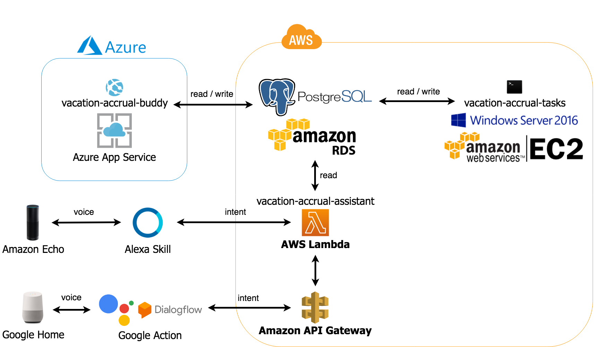

# Vacation Accrual Buddy

A buddy to manage your vacation accruals.

Vacation Accrual Buddy provides:
* A simple way of forecasting your vacation accruals.
* A forecast of when you need to take vacation in order to prevent forfeiting of the accruals.
* Storing and retrieving of your vacation data.
* Forecasting your accruals and balances periodically in the background.
* Automated reminder emails to you to take vacation.
* The tool and ability to plan your vacations better.

## Build Status

| Build server | Platform | Build status
| --- | --- | ---
| AppVeyor | Windows | 
| Travis CI | Linux | 

## Continuous Integration and Continuous Delivery (CI/CD) Pipeline

## Software Architecture

## Software Environment

| Category | Platform
| --- | ---
| Source Code Hosting | [GitHub](https://github.com/)
| Code Quality & Code Review | [Codacy](https://www.codacy.com/)
| Code Quality & Code Review | [CodeFactor](https://www.codefactor.io/)
| Build | [AppVeyor](https://www.appveyor.com/)
| Build & Deployment | [Travis CI](https://travis-ci.org/)
| Application Framework | [ASP.NET Core](https://docs.microsoft.com/en-us/aspnet/core/)
| Application Hosting | [Azure App Service](https://azure.microsoft.com/en-us/services/app-service/)
| Application Analytics | [Google Analytics](https://analytics.google.com/analytics/web/)
| Database | [PostgreSQL](https://www.postgresql.org/)
| Database Hosting | [Amazon RDS](https://aws.amazon.com/rds/)

## Open Source Components

| Type | Software
| --- | ---
| Web Framework | [AspNetCore](https://github.com/aspnet/AspNetCore)
| ORM | [EntityFrameworkCore](https://github.com/npgsql/Npgsql.EntityFrameworkCore.PostgreSQL)
| ORM | [Dapper](https://github.com/StackExchange/Dapper)
| Logging | [NLog](https://github.com/NLog/NLog)
| Front-end Framework | [Bootstrap](https://github.com/twbs/bootstrap)
| Font and Icon Toolkit | [FontAwesome](https://github.com/FortAwesome/Font-Awesome)
| JavaScript Library | [jQuery](https://github.com/jquery/jquery)
| JavaScript Library | [toastr](https://github.com/CodeSeven/toastr)
| Plug-in | [jQuery UI](https://github.com/jquery/jquery-ui)

## Screenshots

## License

Licensed under the [MIT](LICENSE) License.